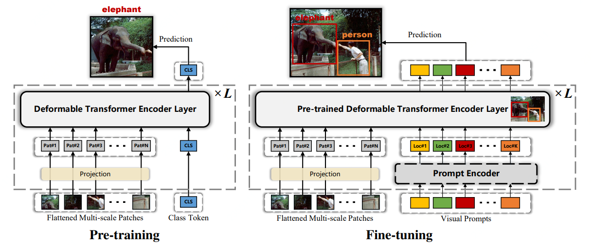
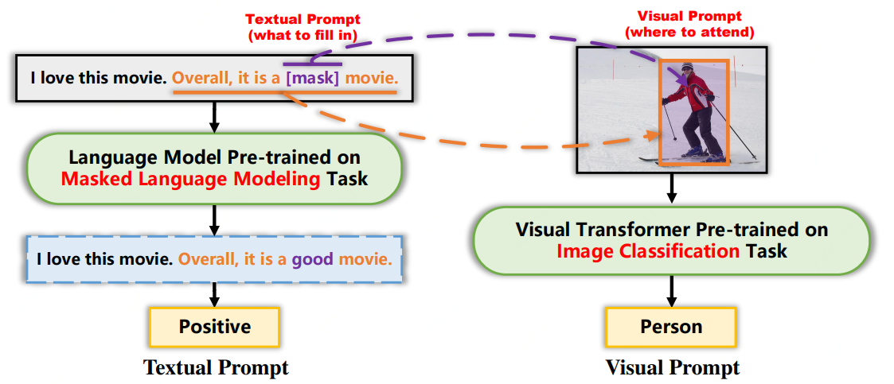

# FP-DETR

By Wen Wang, Yang Cao, Jing Zhang, and Dacheng Tao

This repository is an official implementation of FP-DETR in the paper [FP-DETR: Detection Transformer Advanced by Fully Pre-training](https://openreview.net/pdf?id=yjMQuLLcGWK), which is accepted to ICLR 2022.

## Introduction



**Abstract.**  Large-scale pre-training has proven to be effective for visual representation learning on downstream tasks, especially for improving robustness and generalization. However, the recently developed detection transformers only employ pre-training on its backbone while leaving the key component, i.e., a 12-layer transformer, being trained from scratch, which prevents the model from above benefits. This separated training paradigm is mainly caused by the discrepancy between the upstream and downstream tasks. To mitigate the issue, we propose FP-DETR, a new method that Fully Pre-Trains an encoder-only transformer and smoothly fine-tunes it for object detection via a task adapter. Inspired by the success of textual prompts in NLP, we treat query positional embeddings as visual prompts to help the model attend to the target area (prompting) and recognize the object. To this end, we propose the task adapter which leverages self-attention to model the contextual relation between object query embedding. Experiments on the challenging COCO dataset demonstrate that our FP-DETR achieves competitive performance. Moreover, it enjoys better robustness to common corruptions and generalization to small-size datasets than state-of-the-art detection transformers.



## Main Results

The experimental results and model weights trained on COCO 2017 are shown below.

|       Model       | mAP | mAP@50 | mAP@75 | mAP@S | mAP@M | mAP@L | Model Weights |
| :----------------: | :------: | :------: | :------: | :------: | :------: | :------: | :------: |
| FP-DETR-Lite | 37.9 | 57.5 | 41.1 | 21.7 | 40.6 | 50.7 | [Google Drive](https://drive.google.com/drive/folders/1804OfZzpIQ9TuJG-4-3em3RFAPQj903v?usp=sharing) |
| FP-DETR-Small | 42.5 | 62.6 | 45.9 | 25.3 | 45.5 | 56.9 | [Google Drive](https://drive.google.com/drive/folders/1zbQV_fFk7OQDVBVMSIduvha7vZkFPp3F?usp=sharing) |
| FP-DETR-Base | 43.2 | 63.1 | 47.5 | 25.7 | 46.7 | 57.5 | [Google Drive](https://drive.google.com/drive/folders/1KzqXF_oCJmLMI3ZS6_kYqq3N4_droxSl?usp=sharing) |
| FP-DETR-Base_IN21K-P | 43.7 | 64.1 | 47.8 | 26.5 | 46.7 | 58.2 | [Google Drive](https://drive.google.com/drive/folders/1ys6-r5jnCfaEZ3Vp84s3b0R_rQhvef1o?usp=sharing) |

*Note:*

1. The ImageNet pre-trained weights are available [here](https://drive.google.com/drive/folders/1Mk246J42EHQrb3yzM7JbespNKpGQpCZw?usp=sharing).
2. FP-DETR-Base_IN21K-P is pre-trained on [ImageNet-21K-P](https://arxiv.org/abs/2104.10972), while other models are pre-trained on [ImageNet-1K](https://www.image-net.org/).
3. FP-DETR-Lite and FP-DETR-Base are re-implemented, thus the results are slightly different from what's reported in our paper.
4. All experiments are implemented on NVIDIA A100 GPUs.

## Installation

Our implementation is based on [mmdetection](https://github.com/open-mmlab/mmdetection). Please refer to [get_started.md](docs/get_started.md) for installation.

Note the implementation is based on ```mmdet==2.12.0``` and ```mmcv==1.3.2```.

### Other Requirements
```bash
pip install -r requirements/custom.txt
```

## Usage

### Dataset preparation

The COCO 2017 dataset can be downloaded from [here](https://cocodataset.org) and the Cityscapes datasets can be downloaded from [here](https://www.cityscapes-dataset.com/login/). The Cityscapes annotations in COCO format can be obtained from [here](https://drive.google.com/drive/folders/1t8IVZhLM-4ntd8x-FYGmBtNQEtwHFcQS?usp=sharing). Afterward, please organize the datasets and annotations as following:

```
data
└─ cityscapes
   └─ leftImg8bit
      |─ train
      └─ val
   └─ annotations
      |─ instancesonly_filtered_gtFine_train.json
      └─ instancesonly_filtered_gtFine_val.json
└─ coco
   |─ annotations
   |─ train2017
   └─ val2017
```

### Training

#### Pre-trained weights preparation
Please download the ImageNet pre-trained weights [here](https://drive.google.com/drive/folders/1Mk246J42EHQrb3yzM7JbespNKpGQpCZw?usp=sharing) and organize the weights as following:

```
pretrained_weights
└─ fp-detr-lite
   └─ pretrained_epoch_299.pth
└─ fp-detr-small
   └─ pretrained_epoch_299.pth
└─ fp-detr-base
   └─ pretrained_epoch_299.pth
└─ fp-detr-base_21k-p
   └─ pretrained_epoch_299.pth
```

Note in each folder, ```pretrained_epoch_299.pth``` is obtained by running [postprocess_ckpt.py](tools/tools_custom/postprocess_ckpt.py) on ```epoch_299.pth```. And only ```pretrained_epoch_299.pth``` is needed for fine-tuning.

#### Training FP-DETR-Lite on COCO 2017 with a batch size of 16

```bash
./tools/dist_train.sh configs/fp_detr/fp-detr-lite_in1k.py 8
```

#### Training FP-DETR-Small on COCO 2017 with a batch size of 16

```bash
./tools/dist_train.sh configs/fp_detr/fp-detr-small_in1k.py 8
```

#### Training FP-DETR-Base on COCO 2017 with a batch size of 16

```bash
./tools/dist_train.sh configs/fp_detr/fp-detr-base_in1k.py 8
```

#### Training FP-DETR-Base_IN21K-P on COCO 2017 with a batch size of 16

```bash
./tools/dist_train.sh configs/fp_detr/fp-detr-base_in21k-p.py 8
```

#### Training FP-DETR-Lite on Cityscapes with a batch size of 8

```bash
./tools/dist_train.sh configs/fp_detr_city/fp-detr-lite_in1k_city.py 4
```
Better performance can be achieved on Cityscapes by training with a batch size of 4.


### Evaluation

You can get the trained model (the link is in "Main Results" session), then run following command to evaluate it on the validation set:

```bash
./tools/dist_test.sh <path to config> <path to pre-trained model> <num gpus> --eval bbox
```

e.g. evaluate the trained FP-DETR-Lite on COCO2017 validation set with 8 gpus:
```bash
./tools/dist_test.sh configs/fp_detr/fp-detr-lite_in1k.py work_dirs/fp-detr-lite_in1k/epoch_50.pth 8 --eval bbox
```


## License

This project is released under the [Apache 2.0 license](LICENSE).

## Citing FP-DETR
If you find FP-DETR useful in your research, please consider citing:
```bibtex
@inproceedings{
    wang2022fpdetr,
    title={{FP}-{DETR}: Detection Transformer Advanced by Fully Pre-training},
    author={Wen Wang and Yang Cao and Jing Zhang and Dacheng Tao},
    booktitle={International Conference on Learning Representations},
    year={2022},
    url={https://openreview.net/forum?id=yjMQuLLcGWK}
}
```
